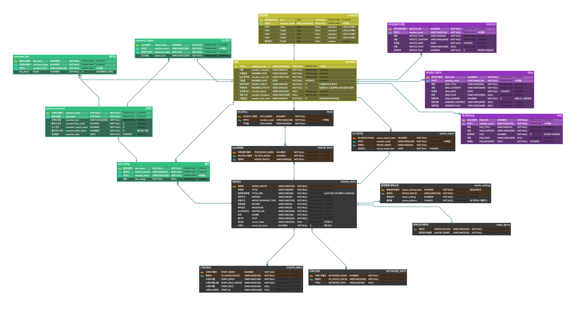

# Final Project
## 1. 프로젝트 개요
- 프로젝트명: Eutchapedia
- KH정보교육원 디지털 컨버전스기반 융합 응용SW 개발자 양성과정 파이널 프로젝트
- 기간: 2021. 01. 21 - 2021. 03. 04
- 참가 인원: 8명
- 프로젝트 목표: 영화 정보 제공 및 사용자들이 자유롭게 평점과 리뷰를 남기고 확인할 수 있는 사이트 제작
  - 벤치마킹: [왓챠피디아](https://pedia.watcha.com/ko-KR/)
- 맡은 역할
```text
- 조장(프로젝트 총괄) 
- 영화 검색
- 영화 상세정보 보기: 기본 정보 확인, 스태프 상세정보 확인, 별점 통계 확인, 컬렉션 정보 확인
- 마이페이지에 원하는 영화 담기('보고싶어요' 기능)
- 별점 및 코멘트 조회/작성/수정/삭제
- 코멘트 좋아요 남기기/신고하기
- 비밀번호 암호화
```
- 👉 [팀 깃허브 바로가기](https://github.com/geniushyeon/KH-FINAL-PROJECT-1)

### 1.1. 개발 환경
- OS: Windows 10 / macOS Big Sur 11.2
- Version Control: Github
- Framework: BootStrap, MyBatis, Spring Boot 2.4.2 
- WireFrame: Kakao Oven
- Front-End: HTML5 / CSS3 / Javascript / jQuery
- Back-End: Java 11.0.8
- WAS: Apache Tomcat 9.0
- DB: OracleDB, SqlDeveloper
- Developer Tools: Spring Tool Suite 4 / vscode
- API: KMDB 영화상세정보 API

### 1.2. 세부 일정
|일정|항목|비고|
|:---:|:---:|:---:|
|01.21 - 01.24|자료 조사 및 주제, 벤치마킹 사이트 선정|
|01.25 - 01.27|개발 범위 결정, 업무 분장|
|01.28 - 01.31|와이어프레임 제작|Kakao Oven
|02.01 - 02.07|프론트엔드 개발|vscode, HTML5, CSS3, Javascript
|02.08 - 02.14|DB 설계 및 SQL문 작성|Oracle, SqlDeveloper
|02.15 - 03.01|백엔드 개발|Spring Tool Suite, MyBatis, Spring Boot 2.4.2
|03.02 - 03.03|서류 작성, 통합 테스트
|03.04|발표|

## 2. ERD

## 3. 세부 기능
### 3.1. 사용자
- 로그인 및 회원가입, 회원정보수정, 회원탈퇴
- 비밀번호 재설정
- 영화 검색
- 장르별 영화 리스트 조회
- 영화 상세정보 조회
- 별점 및 코멘트 조회/작성/수정/삭제
- 공지사항/자주묻는질문 조회
- 일대일문의 조회/작성/수정/삭제
### 3.2. 관리자
- 회원 관리: 블랙리스트 설정/해제
- 영화 DB 관리: 영화 리스트 조회/수정/삭제
- 코멘트 관리: 코멘트 블라인드 처리/해제
- 공지사항/자주묻는질문 조회/등록/수정/삭제
- 일대일문의 조회 및 답변 등록/수정/삭제
## 4. 맡은 기능
- [영화 상세정보 보기](movie-detail/README.md)
  - KMDB 영화정보 API를 통해 로컬 DB에 정보 저장 후 조회
- [별점 및 코멘트 조회/작성/수정/삭제](star-rating/README.md)
  - Ajax를 이용해 페이지 새로고침 없이 작업할 수 있도록 함
- [코멘트 좋아요 남기기/신고하기](comment/README.md)
  - Ajax를 이용해 페이지 새로고침 없이 작업할 수 있도록 함
- [마이페이지에 원하는 영화 담기('보고싶어요' 기능)](wanna-watch/README.md)
  - Ajax를 이용해 페이지 새로고침 없이 작업할 수 있도록 함
- [비밀번호 암호화](encryption/README.md)
  - 해쉬 알고리즘과 솔트를 사용해 암호화 후 저장

## 5. 프로젝트 후기
- 세미 프로젝트 때와는 차원이 다른 볼륨의 프로젝트에서 핵심적인 기능을 맡게 되어 많이 부담스러웠다. 부담이 큰 만큼 기능 구현에 있어서도 시행착오가 많았다. 영화정보 API를 이용해 로컬 DB에 데이터를 넣는 것을 제일 먼저 했어야 했는데, 어려웠고, 어려운 만큼 오래 걸렸다. 하지만 어려운 점이 생길 때마다 팀원들과 소통하며 머리를 맞대니 차근차근 해결할 수 있었다.
- 내가 맡은 기능 중 특히 별점과 좋아요 CRUD가 많이 어려웠다. 별점의 경우에는 벤치마킹한 왓챠피디아의 기능을 그대로 구현하고 싶었지만, 프론트에서부터 막혀서 아쉬움을 뒤로 하고 기능을 축소하였다(원래는 마우스가 over되는 것에 따라 별이 색칠되는 것도 구현하려고 했다). 프론트에서 욕심을 버리니 백단을 구현하는 것은 오히려 생각보다는 간단했던 것 같다.
- 좋아요 기능의 경우, DB를 설계하는 데에 있어 애를 많이 먹었다. 처음에는 단순히 코멘트 테이블에 좋아요 개수 컬럼만 있으면 될 것이라고 생각했었는데, 설계를 하다 보니 사용자가 '좋아요'를 누른 정보를 저장하는 테이블이 따로 필요했던 것이다! 이를 통해 DB 설계의 중요성을 다시 한 번 깨닫게 되었다.
- 세미 프로젝트 때 구현하지 못한 비밀번호 암호화를 구현한 것을 포함하여, 이전의 프로젝트 때 부족했던 점들을 많이 보완할 수 있었던 프로젝트였다. 그리고 팀원들과 소통하며 협업하는 것의 중요성을 다시 한 번 느낄 수 있었다.