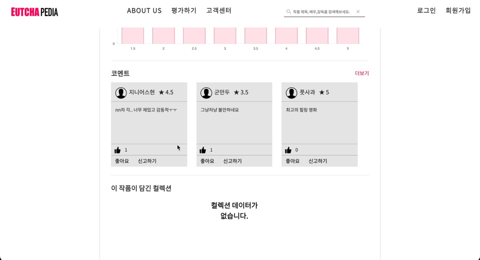
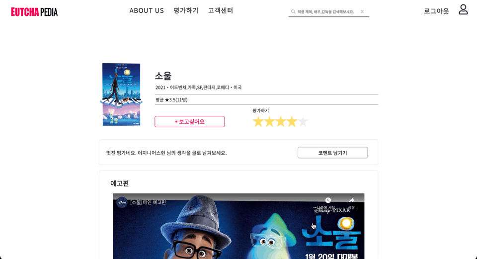
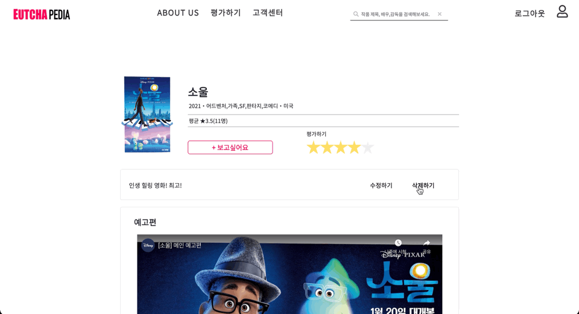
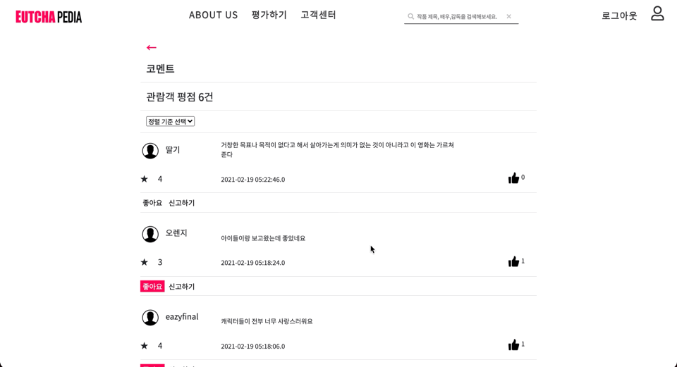
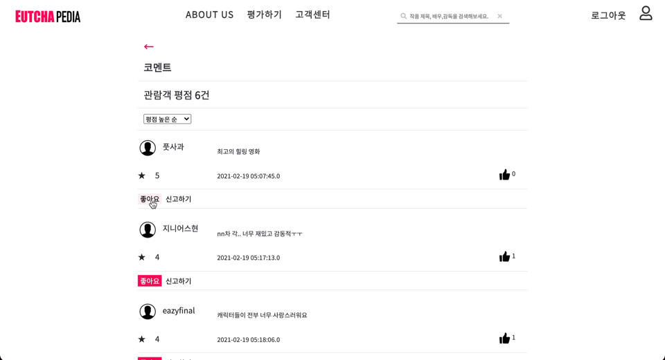
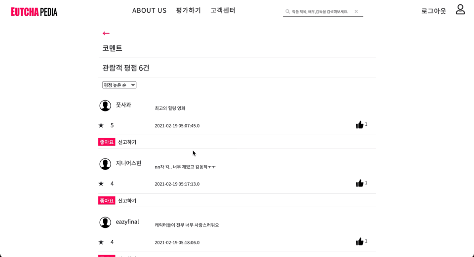

# 코멘트(리뷰)
- 로그인한 사용자는 영화에 코멘트(리뷰)를 남길 수 있다.
- 코멘트는 별점을 남긴 후에 작성 가능하다.
- 다른 사용자가 남긴 코멘트에 대해 좋아요를 남기거나 신고를 할 수 있다.
- Ajax를 이용하여 페이지 새로고침 없이 데이터를 주고받을 수 있도록 처리하였다.
- 코멘트 상세보기 페이지의 경우, 기준별 정렬과 페이징 기능을 구현하였다.

## 1. Workflow
- 비회원은 로그인 후에 이용할 수 있으므로 로그인이 필요하다는 모달을 띄워준다.
- 별점을 남긴 후, 코멘트를 남길 수 있는 div가 나타난다. '코멘트 남기기' 버튼을 누르면 코멘트를 작성할 수 있는 모달이 나타난다.
- 코멘트를 남기면 div 내에 코멘트가 나타나고, 수정하기/삭제하기 버튼이 나타난다.
- 다른 사용자가 남긴 코멘트에 대해 좋아요를 남기거나 신고할 수 있다.

## 2. 시연
### 2.1. 비회원

- 로그인이 필요하다는 모달창을 띄운다.
### 2.2. 회원
#### 2.2.1. 코멘트 작성하기

#### 2.2.2. 코멘트 수정하기

#### 2.2.3. 코멘트 삭제하기

### 2.3. 코멘트 상세보기 페이지

- 페이징 및 기준별 정렬 기능을 구현하였다.
  - 좋아요 많은 순/최신순/평점 높은 순/평점 낮은 순 정렬 가능
#### 2.3.1. 좋아요(회원)

- Ajax를 이용해 비동기적으로 데이터를 주고받을 수 있도록 처리하였다.
#### 2.3.2. 신고하기(회원)

- 신고된 댓글은 관리자 페이지에서 확인 가능하다.

## 3. 코드 보러 가기
### 3.1. 프론트엔드
- jsp
  - [영화상세정보 페이지](https://github.com/geniushyeon/KH-FINAL-PROJECT/blob/main/src/main/webapp/WEB-INF/view/user/movie/detail/movie_detail.jsp)
  - [코멘트 상세보기](https://github.com/geniushyeon/KH-FINAL-PROJECT/blob/main/src/main/webapp/WEB-INF/view/user/movie/detail/rating_more.jsp)
- modal
  - [좋아요(비회원)](https://github.com/geniushyeon/KH-FINAL-PROJECT/blob/main/src/main/webapp/WEB-INF/view/user/movie/detail/modal/like_modal_non_member.jsp)
  - [신고하기(비회원)](https://github.com/geniushyeon/KH-FINAL-PROJECT/blob/main/src/main/webapp/WEB-INF/view/user/movie/detail/modal/report_modal_complete.jsp)
  - [코멘트 남기기](https://github.com/geniushyeon/KH-FINAL-PROJECT/blob/main/src/main/webapp/WEB-INF/view/user/movie/detail/modal/write_comment_modal.jsp)
  - [코멘트 수정하기](https://github.com/geniushyeon/KH-FINAL-PROJECT/blob/main/src/main/webapp/WEB-INF/view/user/movie/detail/modal/update_comment_modal.jsp)
  - [코멘트 삭제하기](https://github.com/geniushyeon/KH-FINAL-PROJECT/blob/main/src/main/webapp/WEB-INF/view/user/movie/detail/modal/delete_comment_modal.jsp)

- css
  - [movie_detail_common.css(공통)](https://github.com/geniushyeon/KH-FINAL-PROJECT/blob/main/src/main/resources/static/css/movie/movie_detail_common.css)
  - [movie_detail.css(비회원)](https://github.com/geniushyeon/KH-FINAL-PROJECT/blob/main/src/main/resources/static/css/movie/movie_detail.css)
  - [movie_detail_member.css(회원)](https://github.com/geniushyeon/KH-FINAL-PROJECT/blob/main/src/main/resources/static/css/movie/movie_detail_member.css)
  - [rating_more.css(코멘트 상세보기 공통)](https://github.com/geniushyeon/KH-FINAL-PROJECT/blob/main/src/main/resources/static/css/movie/rating_more.css)
  - [rating_more_member.css(코멘트 상세보기 회원)](https://github.com/geniushyeon/KH-FINAL-PROJECT/blob/main/src/main/resources/static/css/movie/rating_more_member.css)
- javascript
  - [commentCRUD.js - 코멘트 CRUD](https://github.com/geniushyeon/KH-FINAL-PROJECT/blob/main/src/main/resources/static/js/movie/commentCRUD.js)
  - [likeAndReport.js - 좋아요, 신고하기](https://github.com/geniushyeon/KH-FINAL-PROJECT/blob/main/src/main/resources/static/js/movie/likeAndReport.js)
  - [likeAndReportInCommentOverview.js - 좋아요, 신고하기(코멘트 상세보기 페이지)](https://github.com/geniushyeon/KH-FINAL-PROJECT/blob/main/src/main/resources/static/js/movie/likeAndReportInCommentOverview.js)
### 3.2. 백엔드
- controller
  - [CommentController.java](https://github.com/geniushyeon/KH-FINAL-PROJECT/blob/main/src/main/java/kr/or/eutchapedia/movie/detail/controller/CommentController.java)
  - [CommentLikeController.java](https://github.com/geniushyeon/KH-FINAL-PROJECT/blob/main/src/main/java/kr/or/eutchapedia/movie/detail/controller/CommentLikeController.java)
  - [CommentReportController.java](https://github.com/geniushyeon/KH-FINAL-PROJECT/blob/main/src/main/java/kr/or/eutchapedia/movie/detail/controller/CommentReportController.java)
- domain
  - [CommentListVo.java](https://github.com/geniushyeon/KH-FINAL-PROJECT/blob/main/src/main/java/kr/or/eutchapedia/movie/detail/domain/CommentListVo.java)
  - [CommentPage.java](https://github.com/geniushyeon/KH-FINAL-PROJECT/blob/main/src/main/java/kr/or/eutchapedia/movie/detail/domain/CommentVo.java)
  - [CommentLikeVo.java](https://github.com/geniushyeon/KH-FINAL-PROJECT/blob/main/src/main/java/kr/or/eutchapedia/movie/detail/domain/CommentLikeVo.java)
  - [CommentReportVo.java](https://github.com/geniushyeon/KH-FINAL-PROJECT/blob/main/src/main/java/kr/or/eutchapedia/movie/detail/domain/CommentReportVo.java)
- repository
  - [CommentMapper.java](https://github.com/geniushyeon/KH-FINAL-PROJECT/blob/main/src/main/java/kr/or/eutchapedia/movie/detail/repository/CommentMapper.java)
  - [CommentLikeMapper.java](https://github.com/geniushyeon/KH-FINAL-PROJECT/blob/main/src/main/java/kr/or/eutchapedia/movie/detail/repository/CommentLikeMapper.java)
  - [CommentReportMapper.java](https://github.com/geniushyeon/KH-FINAL-PROJECT/blob/main/src/main/java/kr/or/eutchapedia/movie/detail/repository/CommentReportMapper.java)
- service
  - [CommentDao.java](https://github.com/geniushyeon/KH-FINAL-PROJECT/blob/main/src/main/java/kr/or/eutchapedia/movie/detail/service/CommentDao.java)
  - [CommentLikeDao.java](https://github.com/geniushyeon/KH-FINAL-PROJECT/blob/main/src/main/java/kr/or/eutchapedia/movie/detail/service/CommentLikeDao.java)
  - [CommentReportDao.java](https://github.com/geniushyeon/KH-FINAL-PROJECT/blob/main/src/main/java/kr/or/eutchapedia/movie/detail/service/CommentReportDao.java)
- mapper
  - [comment_mapper.xml](https://github.com/geniushyeon/KH-FINAL-PROJECT/blob/main/src/main/resources/static/mapper/comment_mapper.xml)
  - [comment_like_mapper.xml](https://github.com/geniushyeon/KH-FINAL-PROJECT/blob/main/src/main/resources/static/mapper/comment_like_mapper.xml)
  - [comment_report_mapper.xml](https://github.com/geniushyeon/KH-FINAL-PROJECT/blob/main/src/main/resources/static/mapper/comment_report_mapper.xml)

## 4. 목차로 돌아가기
👉 [여기를 클릭하세요](/kh-final-project/README.md)