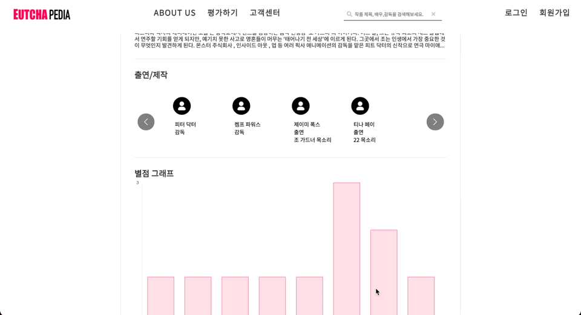
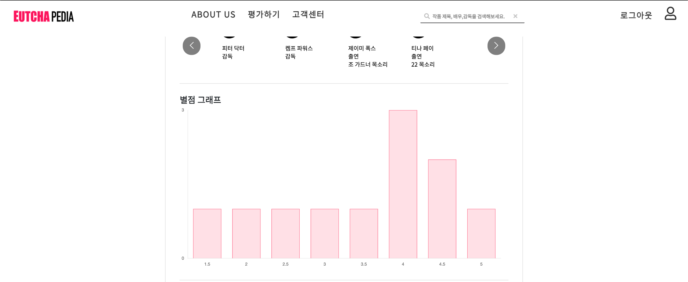
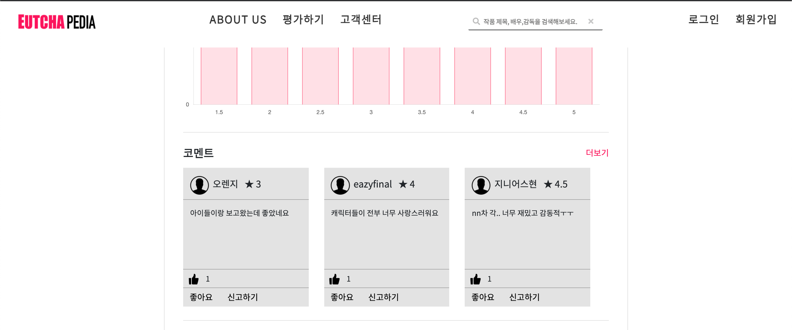

# 영화 정보 상세보기
- 원하는 영화의 정보를 볼 수 있는 페이지이다.
- 영화의 기본 정보, 스태프 정보, 별점 통계, 코멘트(리뷰), 영화가 담긴 컬렉션을 확인할 수 있다.
- 영화 정보 데이터의 경우, `KMDB 영화정보 API`를 이용해 로컬 DB에 정보를 저장한 후, 로컬 DB에 있는 정보를 조회하여 보여주는 식으로 구현하였다.
> DB에 있는 정보를 출력하는 것은 쉬웠는데, 그 전에 API를 이용해 우리가 설계한 DB에 정보를 넣는 것이 너무 어려웠다. 프로젝트 통틀어서 제일 어려웠던 것 TOP3 안에 들 것 같다.. 세미 프로젝트 때 사용했던 Daum 주소 API처럼 만만하게 생각했다가 큰 코 다침.  처음엔 못 할 줄 알았지만 다른 팀원 두 명과 함께 3일 정도 고민하여 하드코딩으로 결국 구현해냈을 때의 뿌듯함은 아직 잊지 못한다.
## 1. Workflow
- 메인/영화 검색/평가하기(장르별 영화보기) 페이지에서 영화를 클릭하면 해당 영화의 상세보기 페이지로 이동한다.
- 예고편, 영화의 기본 정보, 참여 스태프 정보, 회원들이 매긴 별점의 통계, 코멘트 목록, 컬렉션 목록을 확인할 수 있다.
- 각 스태프 이름을 누르면 해당 스태프가 참여한 영화의 목록을 보여주는 페이지로 이동한다.
- 컬렉션 포스터를 누르면 해당 컬렉션의 영화 목록을 보여주는 페이지로 이동한다.
- 회원의 경우 이 페이지에서 보고싶어요(원하는 영화 담기)/별점 매기기/코멘트 달기, 코멘트 좋아요 및 신고하기 기능을 이용할 수 있다.
  - 👉 [보고싶어요 기능 시연 보러가기](./../wanna-watch/README.md)
  - 👉 [별점 기능 시연 보러가기](./../star-rating/README.md)
  - 👉 [코멘트 기능 시연 보러가기](./../comment/README.md)

## 2. 시연
### 2.1. 영화 기본 정보 출력

- 예고편, 원제, 장르, 러닝타임, 줄거리 등 기본적인 정보를 출력한다. 줄거리는 3줄 이상은 말줄임표로 처리하고, '더보기'를 눌러 기본 정보의 상세 페이지로 이동했을 때 나머지 내용까지 나올 수 있도록 처리하였다.
### 2.2. 스태프 정보 확인

- `slick.js` 라이브러리를 사용하여 슬라이더로 편리하게 조회할 수 있도록 구현하였다.

- 스태프 이름을 누르면 해당 스태프가 참여한 다른 영화 목록을 확인할 수 있다.
### 2.3. 별점 통계 확인

- `chart.js` 라이브러리를 사용하여 구현하였다.
- 사이트의 회원들이 매긴 별점의 통계를 확인할 수 있다.
### 2.4. 코멘트 미리보기

- 해당 영화에 남겨진 리뷰를 보여준다. 좋아요 개수 기준 상위 3개만 보여주고, '더보기'를 누를 경우 코멘트 상세보기 페이지로 이동한다.
- 👉 [코멘트 상세보기 기능 시연 보러가기](./comment/README.md)
### 2.5. 컬렉션 데이터 조회하기

- 해당 영화가 들어있는 컬렉션 데이터를 조회할 수 있다.
> 이 부분도 프론트 작업 시에는 슬라이더로 구현했었는데, 백엔드 작업을 시작하니 갑자기 슬라이더가 작동하지 않아서 당황스러웠다. 직접 코딩한 것이 아니라 라이브러리를 사용하다 보니 원인을 찾기가 쉽지 않아서 우선 백엔드 구현에 초점을 맞추고 작업하였으나, UI단에서 미완성이라 많이 아쉬운 부분이다.

## 3. 코드 보러 가기
### 3.1. 프론트엔드
- [jsp](https://github.com/geniushyeon/KH-FINAL-PROJECT/blob/main/src/main/webapp/WEB-INF/view/user/movie/detail/movie_detail.jsp)
- css
  - [movie_detail_common.css(공통)](https://github.com/geniushyeon/KH-FINAL-PROJECT/blob/main/src/main/resources/static/css/movie/movie_detail_common.css)
  - [movie_detail.css(비회원)](https://github.com/geniushyeon/KH-FINAL-PROJECT/blob/main/src/main/resources/static/css/movie/movie_detail.css)
  - [movie_detail_member.css(회원)](https://github.com/geniushyeon/KH-FINAL-PROJECT/blob/main/src/main/resources/static/css/movie/movie_detail_member.css)
- javascript
  - [myslider.js](https://github.com/geniushyeon/KH-FINAL-PROJECT/blob/main/src/main/resources/static/js/movie/myslider.js)
### 3.2. 백엔드
- [controller](https://github.com/geniushyeon/KH-FINAL-PROJECT/blob/main/src/main/java/kr/or/eutchapedia/movie/detail/controller/MovieDetailController.java)
- domain
  - [MovieInfoVo.java](https://github.com/geniushyeon/KH-FINAL-PROJECT/blob/main/src/main/java/kr/or/eutchapedia/movie/detail/domain/MovieInfoVo.java)
  - [StaffInfoVo.java](https://github.com/geniushyeon/KH-FINAL-PROJECT/blob/main/src/main/java/kr/or/eutchapedia/movie/detail/domain/StaffInfoVo.java)
  - [StaffFilmoVo.java](https://github.com/geniushyeon/KH-FINAL-PROJECT/blob/main/src/main/java/kr/or/eutchapedia/movie/detail/domain/StaffFilmoVo.java)
- [repository](https://github.com/geniushyeon/KH-FINAL-PROJECT/blob/main/src/main/java/kr/or/eutchapedia/movie/detail/repository/MovieDetailMapper.java)
- [service](https://github.com/geniushyeon/KH-FINAL-PROJECT/blob/main/src/main/java/kr/or/eutchapedia/movie/detail/service/MovieDetailDao.java)
- [mapper](https://github.com/geniushyeon/KH-FINAL-PROJECT/blob/main/src/main/resources/static/mapper/movie_detail_mapper.xml)

## 4. 목차로 돌아가기
👉 [여기를 클릭하세요](/kh-final-project/README.md)