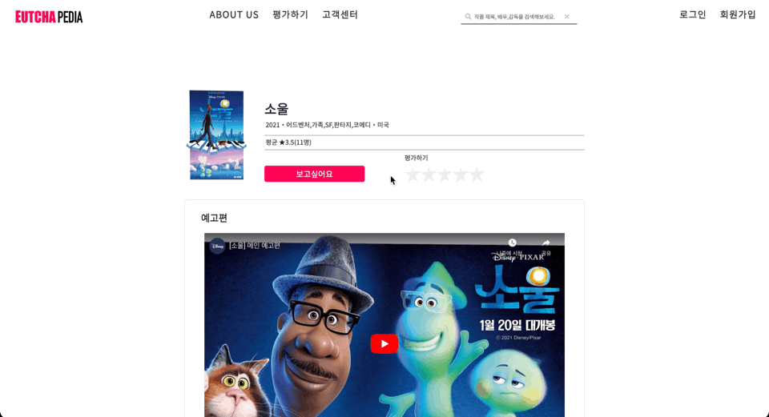

# 보고싶어요(원하는 영화 담기)
- 사용자가 원하는 영화를 마이페이지에 담아둘 수 있는 기능이다. 담은 영화는 마이페이지의 '보고싶어요' 탭에서 확인 가능하다.

## 1. Workflow
- 비회원이 시도할 시, 로그인하라는 모달 창을 띄워준다.
- 로그인 후 시도할 시, Ajax를 통해 비동기적으로 데이터를 주고받아 view단에서 바로 확인할 수 있게끔 처리하였다.

## 2. 시연
### 2.1. 비회원

- 회원가입 혹은 로그인이 필요하다는 모달을 출력한다.
### 2.2. 회원

- Ajax로 비동기적으로 통신할 수 있도록 처리하여 뷰단에서 결과를 바로 확인할 수 있다.
- 마이페이지에서도 동일하게 결과를 확인할 수 있다.

## 3. 코드 보러 가기
### 3.1. 프론트엔드
- [jsp](https://github.com/geniushyeon/KH-FINAL-PROJECT/blob/main/src/main/webapp/WEB-INF/view/user/movie/detail/movie_detail.jsp)
- [modal](https://github.com/geniushyeon/KH-FINAL-PROJECT/blob/main/src/main/webapp/WEB-INF/view/user/movie/detail/modal/wanna_watch_non_member.jsp)
- css
  - [movie_detail_common.css(공통)](https://github.com/geniushyeon/KH-FINAL-PROJECT/blob/main/src/main/resources/static/css/movie/movie_detail_common.css)
  - [movie_detail.css(비회원)](https://github.com/geniushyeon/KH-FINAL-PROJECT/blob/main/src/main/resources/static/css/movie/movie_detail.css)
  - [movie_detail_member.css(회원)](https://github.com/geniushyeon/KH-FINAL-PROJECT/blob/main/src/main/resources/static/css/movie/movie_detail_member.css)
- [javascript](https://github.com/geniushyeon/KH-FINAL-PROJECT/blob/main/src/main/resources/static/js/movie/movie_detail_member.js)
### 3.2. 백엔드
- [controller](https://github.com/geniushyeon/KH-FINAL-PROJECT/blob/main/src/main/java/kr/or/eutchapedia/movie/detail/controller/WannaWatchController.java)
- [domain](https://github.com/geniushyeon/KH-FINAL-PROJECT/blob/main/src/main/java/kr/or/eutchapedia/movie/detail/domain/WannaWatchVo.java)
- [repository](https://github.com/geniushyeon/KH-FINAL-PROJECT/blob/main/src/main/java/kr/or/eutchapedia/movie/detail/repository/WannaWatchMapper.java)
- [service](https://github.com/geniushyeon/KH-FINAL-PROJECT/blob/main/src/main/java/kr/or/eutchapedia/movie/detail/service/WannaWatchDao.java)
- [mapper](https://github.com/geniushyeon/KH-FINAL-PROJECT/blob/main/src/main/resources/static/mapper/wanna_watch_mapper.xml)

## 4. 목차로 돌아가기
👉 [여기를 클릭하세요](/kh-final-project/README.md)