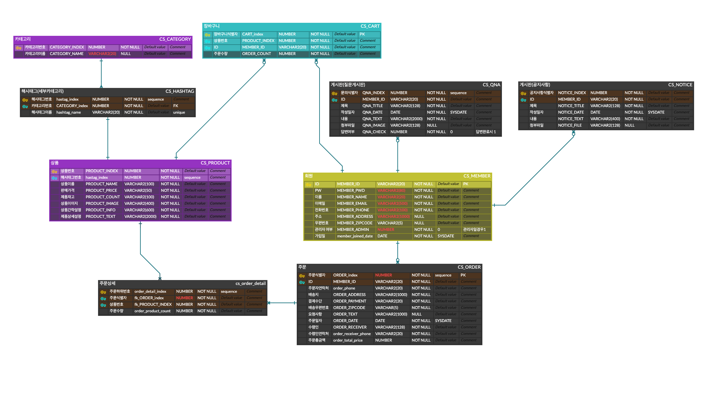

# Semi Project
## 1. 프로젝트 개요
- 프로젝트명: Coffeesazo
- KH정보교육원 디지털 컨버전스기반 융합 응용SW 개발자 양성과정 세미 프로젝트
- 기간: 2020. 12. 04 - 2021. 01. 12
- 참가 인원: 7명
- 프로젝트 목표: 배운 것들을 최대한 활용하여 쇼핑몰 서비스를 구현하되, 많은 기능을 구현하려고 하기보다는 적은 기능을 '잘' 구현하자.
- 맡은 역할
```text
조장(프로젝트 총괄), 메인(헤더/푸터), 회원가입, 공지사항(백엔드), 마이페이지(주문상세조회, 회원정보수정 백엔드)
```
- 👉 [팀 깃허브 바로가기](https://github.com/geniushyeon/kh-semiproject)
### 1.1. 개발 환경
- OS: Windows 10 / macOS Catalina 10.15.7
- Version Control: Github
- Framework: Bootstrap
- Wireframe: Kakao Oven
- Front-end: HTML5 / CSS3 / javascript / jQuery
- Back-end: Java 11.0.8
- WAS: Apache Tomcat 9.0
- DB: Oracle, ERDCloud
- Developer Tools: Eclipse EE / vscode / SqlDeveloper
- API: 다음 주소 API
### 1.2. 세부 일정
|일정|항목|비고|
|:---:|:---:|---|
|12.04 - 12.06|자료 조사 및 주제 선정|
|12.07 - 12.11|와이어프레임 제작
|12.12 - 12.14|메인 페이지 제작
|12.15 - 12.20|역할 분담 및 프론트엔드 개발
|12.21 - 12.27|프론트엔드 버그 수정 및 DB 설계 시작|
|12.28 - 12.31|DB 설계 완료 및 SQL문 작성|
|01.01 - 01.08|백엔드 개발
|01.09 - 01.11|테스트 및 발표 준비, 버그 수정|
|01.12|발표
## 2. ERD
<br/>
## 3. 맡은 기능
- [회원가입](signup/signup.md)
  - Javascript 정규식을 이용해 유효성 검사
  - Ajax를 통해 페이지 새로고침 없이 중복 확인
- [메인(헤더/푸터)](header-and-footer/README.md)
- [주문상세조회](order-detail/README.md)
  - 주문 상세정보 조회 및 주문 취소
- [회원정보수정](update-info/README.md)
  - Javascript 정규식을 이용해 유효성 검사
  - Ajax를 통해 페이지 새로고침 없이 중복 확인
- [공지사항](notice/README.md)
  - 검색 및 페이징 기능

## 4. 프로젝트 후기
- 웹 개발을 배우고 처음으로 수행하는 프로젝트였기에 시행착오가 많았다. 특히, 조장을 맡게 되어 코드만 짜도 엄청 바쁜데 깃허브 관리, 문서 정리 등 코딩 이외의 것들도 같이 하려고 하다 보니 더 부담스러웠던 것 같다. 깃허브의 경우에는 macOS 사용자와 Windows 사용자 간에 충돌(CRLF / LF)이 있었는데, 이 점을 프로젝트 끝난 후에 알게 되어 팀원들에게 미안한 마음이 컸다.
- 관리자 기능 구현 여부에 대해 팀원들과 초기에 충돌이 있었는데, 관리자 기능까지 구현하려고 하다가 사용자 기능을 놓치게 될 수도 있을 것 같아 사용자 기능만 구현하게 되었다. 계획했던 기능들은 모두 구현하였지만, 다음 프로젝트 때는 실력을 더 쌓아서 관리자 기능도 구현하자고 다짐하였다.