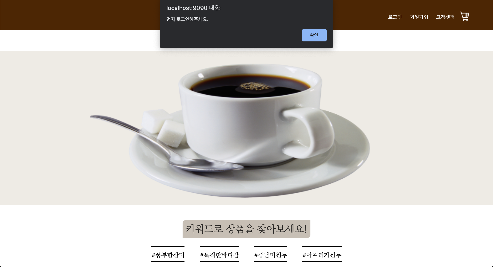
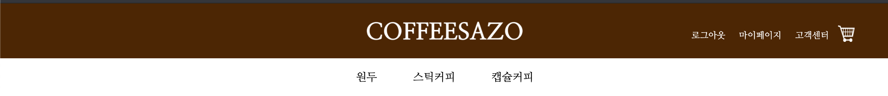

# 메인(헤더/푸터)
- 사용자가 홈페이지에 처음 접속했을 때 보이는 페이지인 만큼 한 사람에게 맡기는 것보다는 모든 조원이 작업한 후 좋은 부분만 고르는 것이 맞다고 판단하였고, 내가 작업한 헤더와 푸터가 최종적으로 사용되었다.
## 2. 시연
### 2.1. 헤더
#### 2.1.1. 비회원
 
- 중앙의 로고를 클릭하면 메인 페이지로 돌아온다.
- 로그인/회원가입/고객센터/장바구니로 이동할 수 있다.
  - 비회원이 장바구니로 이동을 시도할 경우 로그인이 필요하다는 alert창이 출력되고 로그인 창으로 이동한다.
- 원두/스티거피/캡슐커피 각각의 페이지로 이동 가능하다.
- 스크롤이 내려가더라도 상단에 헤더가 고정된다.
- 장바구니 이동 시도
 
#### 2.1.2. 회원
 
- 로그인/회원가입 버튼이 로그아웃/마이페이지 버튼으로 바뀐다.

### 2.2. 푸터
 
- 회사에 대한 정보를 기입하였다.
- 화면 크기가 변경되어도 최하단에 고정된다.

## 3. 코드
1. header
- [jsp](https://github.com/geniushyeon/kh-semiproject/blob/main/backend/Coffeesazo/WebContent/header.jsp)
- [css](https://github.com/geniushyeon/kh-semiproject/blob/main/backend/Coffeesazo/WebContent/view/css/header.css)
1. footer
- [jsp](https://github.com/geniushyeon/kh-semiproject/blob/main/backend/Coffeesazo/WebContent/footer.jsp)
- [css](https://github.com/geniushyeon/kh-semiproject/blob/main/backend/Coffeesazo/WebContent/view/css/footer.css)

## 4. 목차로 돌아가기
👉 [여기를 클릭하세요](/kh-semiproject/README.md)