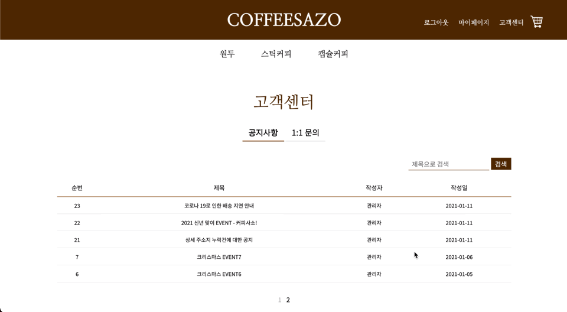
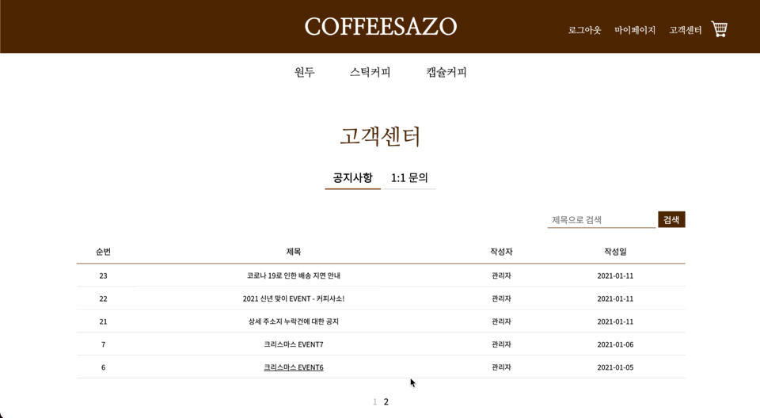

# 공지사항
- 공지사항을 열람할 수 있는 페이지이다.
## Workflow
- 헤더의 고객센터 메뉴 클릭 시 공지사항 페이지로 이동한다.
- 제목으로 검색이 가능하다.
- 한 페이지에 5건의 데이터를 출력하며, 페이징이 가능하다.
- 각 공지사항의 제목 클릭 시 공지사항의 상세 내역으로 이동한다.
## 검색
 
## 페이징
 
## 게시글 상세보기

## 코드
- [view](https://github.com/geniushyeon/kh-semiproject/blob/main/backend/Coffeesazo/WebContent/view/notice/notice.jsp)
- [css](https://github.com/geniushyeon/kh-semiproject/blob/main/backend/Coffeesazo/WebContent/view/css/notice.css)
- [servlet](https://github.com/geniushyeon/kh-semiproject/blob/main/backend/Coffeesazo/src/com/coffeesazo/notice/controller/NoticeServlet.java)
- [dao](https://github.com/geniushyeon/kh-semiproject/blob/main/backend/Coffeesazo/src/com/coffeesazo/notice/model/dao/NoticeDao.java)
- [service](https://github.com/geniushyeon/kh-semiproject/blob/main/backend/Coffeesazo/src/com/coffeesazo/notice/model/service/NoticeService.java)
- [vo](https://github.com/geniushyeon/kh-semiproject/blob/main/backend/Coffeesazo/src/com/coffeesazo/notice/model/vo/NoticeVo.java)