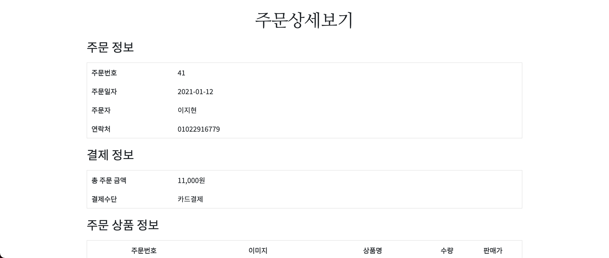
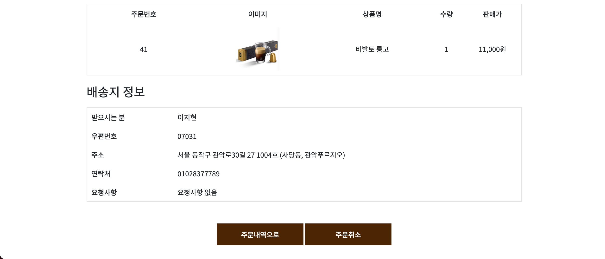
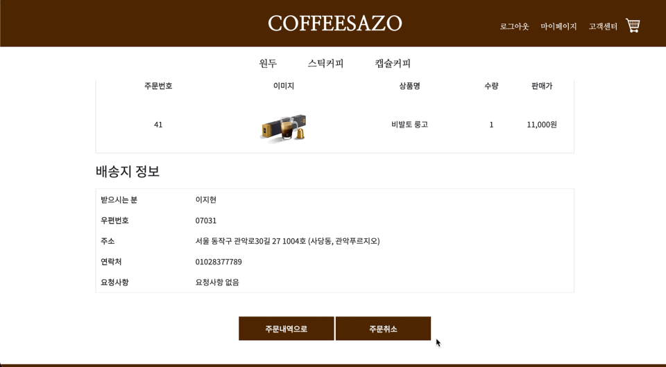

# 주문상세보기
- 사용자가 주문한 내역의 상세 정보를 볼 수 있는 페이지다.
## 1. Workflow
- 마이페이지의 나의주문조회 메뉴에서 주문한 항목을 클릭하면, 해당 주문번호의 상세정보를 출력한다.
- 주문 취소를 누를 경우 '주문을 취소하시겠습니까?'라는 alert 창이 나타나고, '확인'을 누를 경우 주문이 취소된다.
- '주문내역으로'를 누르면 나의주문조회 페이지로 이동한다.
## 2. 시연
### 2.1. 기본 화면
 
 
- DB에서 주문번호에 해당하는 주문 상세정보를 불러온다.
### 2.2. 삭제 화면

- 주문취소 - 확인 과정을 거쳐 주문이 취소된다.
## 3. 코드
- [view](https://github.com/geniushyeon/kh-semiproject/blob/main/backend/Coffeesazo/WebContent/view/mypage/mypage_order_detail.jsp)
  - [css](https://github.com/geniushyeon/kh-semiproject/blob/main/backend/Coffeesazo/WebContent/view/css/mypage_order_detail.css)
- [servlet(주문상세보기)](https://github.com/geniushyeon/kh-semiproject/blob/main/backend/Coffeesazo/src/com/coffeesazo/mypages/controller/OrderDetailServlet.java)
- [servlet(주문취소)](https://github.com/geniushyeon/kh-semiproject/blob/main/backend/Coffeesazo/src/com/coffeesazo/mypages/controller/OrderDetailDeleteServlet.java)
- [dao](https://github.com/geniushyeon/kh-semiproject/blob/main/backend/Coffeesazo/src/com/coffeesazo/mypages/model/dao/OrderDetailDao.java)
- [service](https://github.com/geniushyeon/kh-semiproject/blob/main/backend/Coffeesazo/src/com/coffeesazo/mypages/model/service/OrderDetailService.java)
- [vo](https://github.com/geniushyeon/kh-semiproject/blob/main/backend/Coffeesazo/src/com/coffeesazo/mypages/model/vo/OrderDetailVo.java)

## 4. 목차로 돌아가기
👉 [여기를 클릭하세요](/kh-semiproject/README.md)