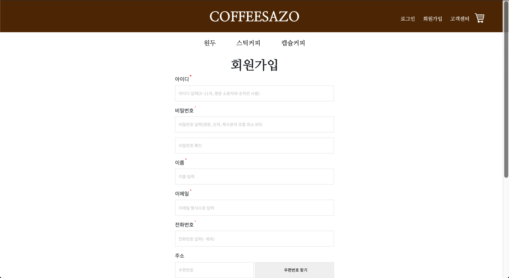
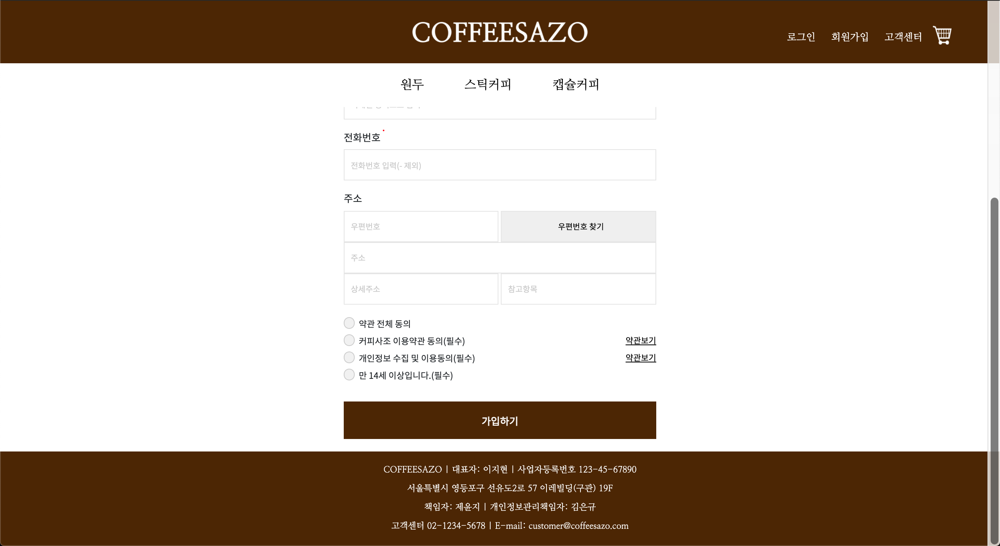
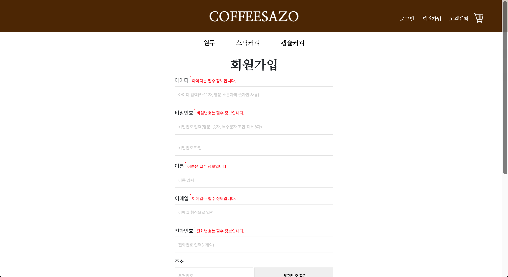
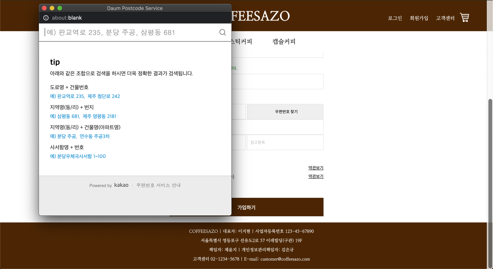

# 회원가입
- 벤치마킹: 무신사 회원가입 페이지(https://my.musinsa.com/member/v2/join)
## Workflow
- 홈페이지에 접속한 회원은 아이디, 비밀번호, 이름, 이메일, 전화번호, 주소로 가입한다.
- 주소를 제외한 정보는 필수 정보이다.
- 아이디, 이메일, 전화번호는 중복확인을 거친다. 이 때, ```Ajax```를 이용하여 페이지를 새로 고치지 않고 할 수 있도록 한다.
- 중복확인과 동시에 javascript의 정규식을 활용하여 유효성 검사를 거친다.
  - 필수 정보가 기입되지 않았거나 형식에 맞지 않을 경우 경고 메시지를 출력한다. 조건에 부합할 경우 사용 가능하다는 메시지를 출력한다.
- 주소를 입력할 때는 ```daum 주소 API```를 사용한다.
- 필수 기입 정보와 필수 동의 약관에 모두 동의해야만 회원가입을 완료할 수 있다.
## 기본 화면
<br/>
<br/>
## 경고 메시지 출력화면
<br/>
- 비밀번호와 비밀번호 확인의 값이 일치하지 않을 경우, 경고 메시지를 출력해준다.
## 사용 가능 메시지 출력화면
<br/>
- 비밀번호의 경우 보안 상의 문제로 메시지를 출력하지 않는 방향을 선택하였다.
## daum 주소 API
<br/>
## 약관보기

- 가독성을 고려하지 않은 점이 아쉽다.
## 약관 동의 없이 가입 시도했을 때 화면
<br/>
- 약관에는 동의했지만 필수 정보가 채워지지 않을 때도 마찬가지로 alert창을 띄운다.
## 회원가입 완료
<br/>
- 유저의 아이디 정보를 보여준다.
## 코드
- [회원가입(view)](src/signup.jsp)
  - [회원가입(css)](src/signup.css)
- [회원가입 완료(view)](src/signup_complete.jsp)
  - [회원가입 완료(css)](src/signup_complete.css)
- [약관(view)](src/coffeesazo_admit.jsp)
- [회원가입(javascript)](src/signup.js)
- [회원가입(servlet)](src/SignupServlet.java)
- [아이디 중복확인 servlet](src/IdDuplicatedServlet.java)
- [이메일 중복확인 servlet](src/EmailDuplicatedCheckServlet.java)
- [휴대폰번호 중복확인 servlet](src/PhoneDuplicatedCheckServlet.java)
- [회원 vo](src/MemberVo.java)
- [회원 Dao](src/MemberDao.java)