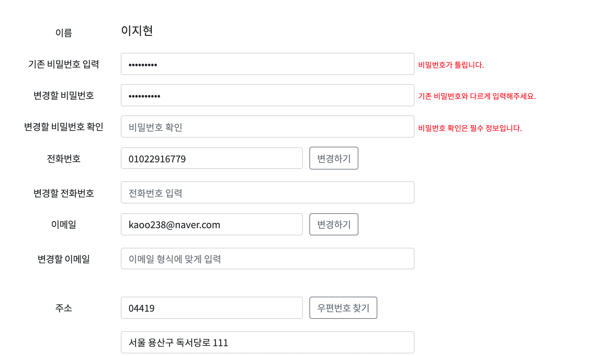
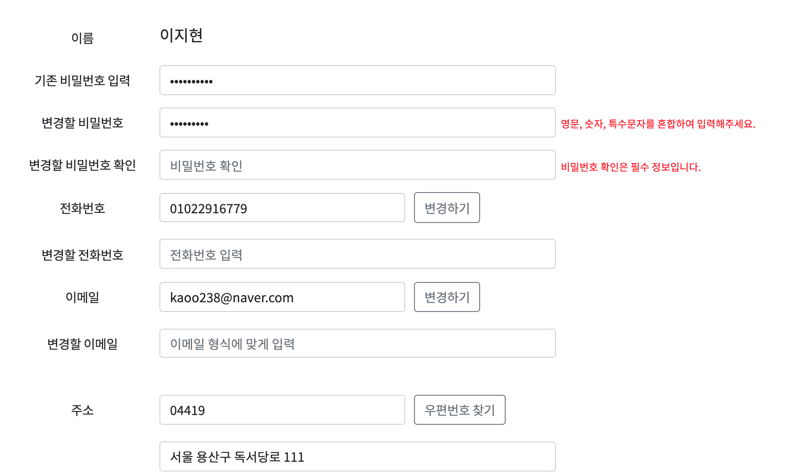
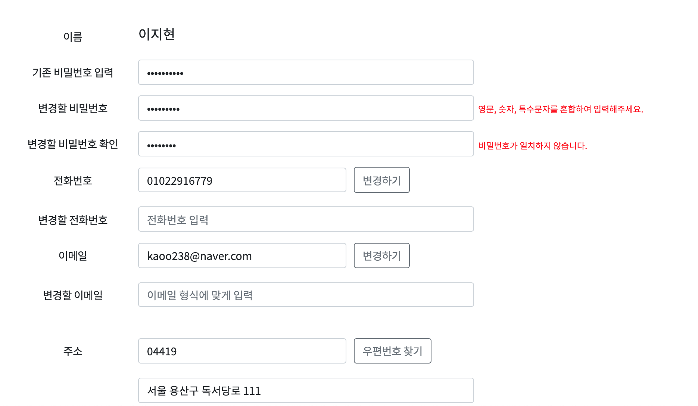
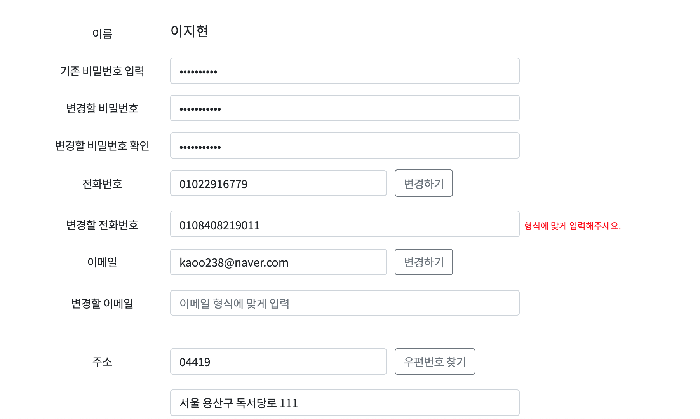
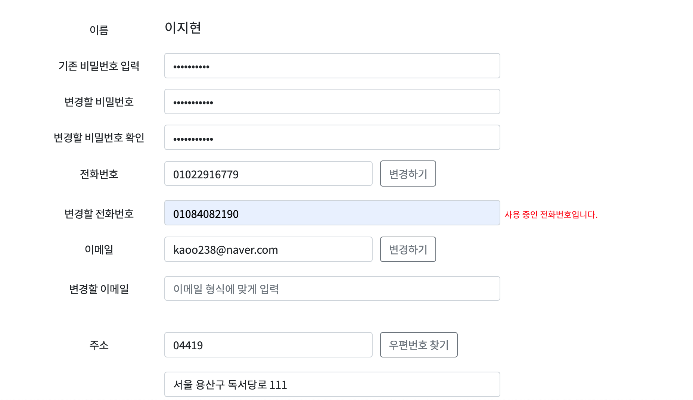
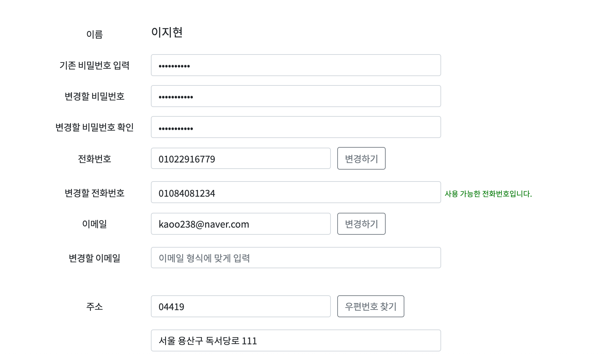
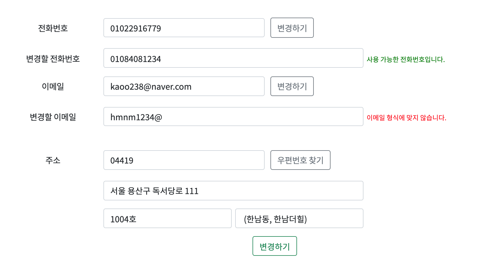
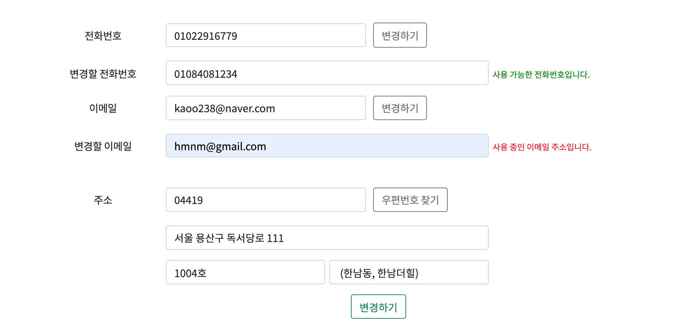
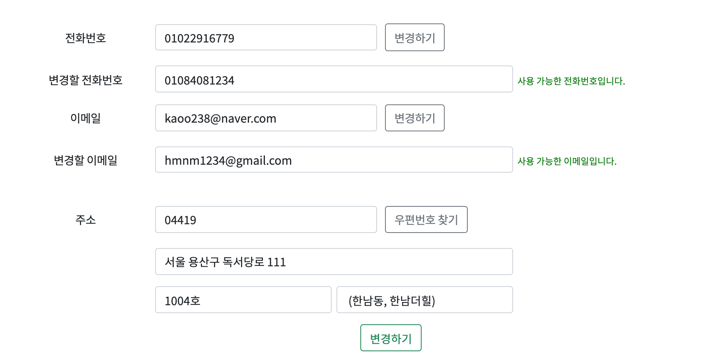
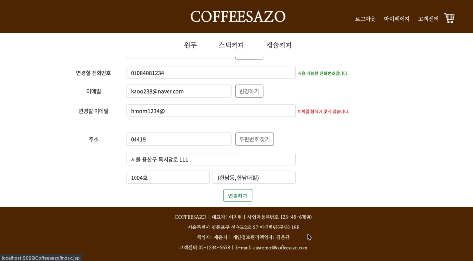

# 회원정보수정(백엔드 작업)
- 사용자가 본인의 회원 정보를 수정할 수 있는 페이지이다.
## Workflow
- 이름을 제외한 모든 정보를 수정할 수 있다.
- 비밀번호, 전화번호, 이메일 주소는
  -  Javascript의 정규식을 이용하여 유효성 검사를 거친다.
  -  Ajax를 이용하여 중복 확인이 가능하다.
- 주소는 Daum 주소 API를 사용하여 수정 가능하다.
- 기존 비밀번호를 입력해야 최종적으로 수정이 가능하다.
## 유효성 검사
### 1. 비밀번호

- 기존 비밀번호가 틀릴 경우 경고 메시지 출력
- 기존 비밀번호와 같게 입력했을 경우 경고 메시지 출력
- 변경할 비밀번호는 입력했으나, 비밀번호 확인 창이 비어 있을 경우 경고 메시지 출력 
 
- 비밀번호 양식에 맞지 않을 경우 경고 메시지 출력
 
- 변경할 비밀번호와 비밀번호 확인이 일치하지 않을 경우 경고 메시지 출력

## 2. 전화번호
 
- 전화번호 양식에 맞지 않을 경우 경고 메시지 출력
 
- Ajax를 통해 중복 확인 후 사용 중인 전화번호일 경우 경고 메시지 출력
 
- 유효성 검사와 중복 확인 통과 시 사용 가능 메시지 출력
### 3. 이메일 주소
 
- 이메일 양식에 맞지 않을 경우 경고 메시지 출력
 
- Ajax를 통해 중복 확인 후 사용 중인 이메일 주소일 경우 경고 메시지 출력
 
- 유효성 검사와 중복 확인 통과 시 사용 가능 메시지 출력

## 최종 회원정보수정
 
- 기존 비밀번호 미입력 시 회원정보수정 불가능

## 코드 보러 가기
- [view](https://github.com/geniushyeon/kh-semiproject/blob/main/backend/Coffeesazo/WebContent/view/mypage/Mypage_edit.jsp)
  - [css](https://github.com/geniushyeon/kh-semiproject/blob/main/backend/Coffeesazo/WebContent/view/css/Mypage_edit.css)
  - [javascript](https://github.com/geniushyeon/kh-semiproject/blob/main/backend/Coffeesazo/WebContent/view/js/mypage_edit.js)
- [servlet](https://github.com/geniushyeon/kh-semiproject/blob/main/backend/Coffeesazo/src/com/coffeesazo/mypages/controller/UpdateMemberInfoServlet.java)
- [dao](https://github.com/geniushyeon/kh-semiproject/blob/main/backend/Coffeesazo/src/com/coffeesazo/member/model/dao/MemberDao.java)
- [vo](https://github.com/geniushyeon/kh-semiproject/blob/main/backend/Coffeesazo/src/com/coffeesazo/member/model/vo/MemberVo.java)